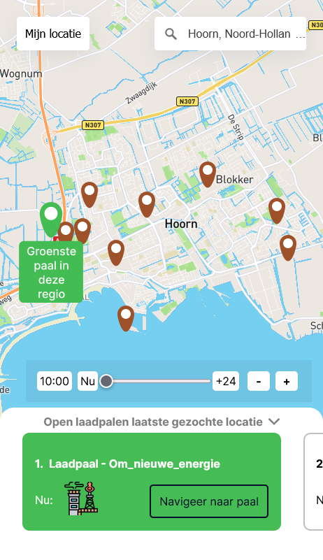

# ⚙ Hoe fossiel vrij is deze laadpaal



## 📂 Assignment
Built and develop a webapplication where it is possible to see where a user can load sustainable, or where he/she can do it at the best place possible.

## 🧾 Table of contents
-   [About the project](##About-the-project)
      * [Built with](###Built-with)
-   [Getting started](##Getting-started)
      * [Installation](##Installation)
-   [Packages/Dependecies](##Packages/dependecies)
      * [Dependecies](##Dependecies)
      * [Dev dependecies](##Dev-dependecies)
-   [License](##License)

## 📖 About the project
The project is about getting EV users to load more sustainable, loading green cars is not as green as people think, when we load at the wrong moment the energy that is loaded into the EV is not green at all, it consists of energy produced by coal/gas stations, this means we are not driving green at all.

The CO2 emitted at other moments of the same day are far less and that moments should be motivated to EV users, because the driving of green cars is much greener when loading at that certain moment.

## 🛠 Built with
Node.js, Express, Pug, SCSS

## 🔍 Getting started
*Before you can start you need to follow the installation*

## 🔨 Installation
1. Open the terminal, or use the terminal in your IDE

2. Clone the repository
```
git clone https://github.com/KoenHaagsma/hoe-fossielvrij-is-deze-laadpaal.git
```
3. Go to the cloned repository
```
cd ../../hoe-fossielvrij-is-deze-laadpaal
```
4. Install all packages
```
npm install || npm i
```
5. Start the application for development
```
npm run dev
```
6. Open de server and go to the browser: [Localhost](http://localhost:1337/). If this doesn't work change your port to another port

## 🧰 Packages/dependecies

### 🧱 Dependecies
- [@influxdata/influxdb-client](https://www.npmjs.com/package/@influxdata/influxdb-client)
- [@turf/turf](https://www.npmjs.com/package/@turf/turf)
- [compression](https://www.npmjs.com/package/compression)
- [cors](https://www.npmjs.com/package/cors)
- [dotenv](https://www.npmjs.com/package/dotenv)
- [express](https://www.npmjs.com/package/express)
- [node-fetch](https://www.npmjs.com/package/node-fetch)
- [path](https://www.npmjs.com/package/path)
- [pug](https://www.npmjs.com/package/pug)

### 🧱 Dev dependecies
- [minify](https://www.npmjs.com/package/minify)
- [nodemon](https://www.npmjs.com/package/nodemon)

## 🔖 License
[]()
